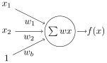

AI has been impacting our life nowadays, from image classification to ChatGPT, the evolution is very fast! Most of the AI models are implemented by using deep learning technique, which is using a huge amount of data to train the model to get better results for prediction.

Large deep learning model is very complex, but small model is relatively understandable and can do a lot of things, like image classification, sales forecasting, recommendation etc.

## Perception

The basic idea of deep learning is consisted by perceptions, which calculate from the input data to a prediction output. For instance, an output 0.3 is a probability of an image of a cat.

Even a single can do prediction. To simpify, we can create a preception with 2 inputs and 1 output, and it can form an equation as $f(x) = w_1x_1 + w_2x_2 + b.$

Where $x_1, x_2$ are the input data, and $w_1, w_2, b$ are the weights and bias can be updated by training to output a more accurate value by the equation. The bias can be also written in $w_3 * 1$.

How can it be used to predict? Let's say there are a group of data with weights and heights for either cats or mouses, it can be plotted a graph like:

We can draw a line to split the data to separate to the two groups, which is a task can be performed by the preception: if $f(x) >= 0$ then it is a cat, else it is a mouse.

## Training
