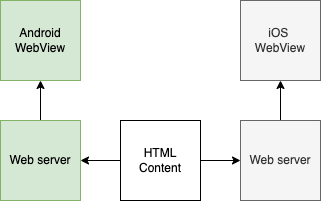

To build mobile apps, you might consider using React Native or Flutter. But using `webview` could also be considered, as following diagram:



As you see the HTML content can be shared to both Android and iOS as UI development. You might also notice that also includes web servers in mobile apps, there are some purposes for the setup:
1. To run web frameworks properly (Most frontend framework needs an HTTP server for routing)
2. Handle async action easier via HTTP request/response
3. More security as you can hide tokens on mobile, using the web server as a proxy

In Android, I found [Ktor] for setting up a web server:

```kotlin
embeddedServer(Netty, port = 8080) {
    routing {
        get("/myreactapp/{...}") {
            val uri = call.request.uri
            val path = uri.removePrefix("/myreactapp/")
            val ext = path?.substringAfterLast('.')

            val reg = Regex("png|jpg|js|css|ico|json|svg")
            if (ext != null && reg.matches(ext)) {
                var contentType = when (ext) {
                    "ico" -> "image/x-icon"
                    "jpg" -> "image/jpeg"
                    "png" -> "image/png"
                    "css" -> "text/css; charset=UTF-8"
                    "js" -> "application/javascript; charset=UTF-8"
                    "json" -> "application/json; charset=UTF-8"
                    "svg" -> "image/svg+xml"
                    else -> "text/plain"
                }

                call.respondOutputStream(ContentType.parse(contentType)) {
                    val f = assets.open("myreactapp/${path}")
                    f.copyTo(this)
                }
            } else {
                call.respondOutputStream(ContentType.parse("text/html; charset=UTF-8")) {
                    val indexHtml = assets.open("myreactapp/index.html")
                    indexHtml.copyTo(this)
                }
            }
        }
    }
}.start()
```

This will execute the react app under assets/myreactapp folder when browsing http://localhost:8080/myreactapp/ in `webview`.

Til now [Ktor] server didn't support iOS so you might find some alternatives.

Using WebView can share UI development for both Android and iOS, but you still need to develop REST APIs for each platform. It still has some benefits as you can use all native features and get native performance.

[Ktor]: https://ktor.io/
