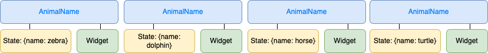

If you have developed Flutter apps, you might be aware that keys need to be set to render a list of widgets properly. But why is not it required for stateless widgets? Let’s go through about it.

Here is a sample app that tries to reverse the animal names. [Animal names app](https://zapp.run/edit/flutter-z5ze06it5zf0?entry=lib/main.dart&file=lib/main.dart)

If you click the button in the app, it will not work. Let's try to fix it by uncommenting the code as:

```dart
// ...
class AnimalNamesState extends State<AnimalNames> {
  List<AnimalName> animals = [];

  @override
  initState() {
    super.initState();

    animals = [
      AnimalName(key: UniqueKey(), name: "zebra"),
      AnimalName(key: UniqueKey(), name: "dolphin"),
      AnimalName(key: UniqueKey(), name: "horse"),
      AnimalName(key: UniqueKey(), name: "turtle"),
    ];
  }

// ...
class AnimalName extends StatefulWidget {
  const AnimalName({required Key key, required this.name}) : super(key: key);

  final String name;

  @override
  AnimalNameState createState() => AnimalNameState();
}
```
And now it works! What happened? We can use the debugger in Visual Studio Code to see what happened inside. As for the following setting, you need to set the debug mode to `Debug my code + packages + SDK` to look into the flutter source code and the run debugging in the `Run and Debug` tab.


In Visual Studio Code, set a breakpoint at the setState. Then try to run step into, step over a few times, and you will find that it will run the `updateChildren` method.

Keep looking at the method, it calls `Widget.canUpdate` to verify the widget whether can be updated.

```dart
static bool canUpdate(Widget oldWidget, Widget newWidget) {
    return oldWidget.runtimeType == newWidget.runtimeType
        && oldWidget.key == newWidget.key;
}
```

If the keys are not set, animals keep the same type after reversing. So the `canUpdate` will return true to let the elements update their widgets. But it still keeps the same layout since it only updated the widgets from `AnimalNameState.build` to `AnimalNameState.build`, and the names in the states are not changed.

You can think the `AnimaName` components represent this diagram:


To solve it we need to set keys to the widgets, Flutter can use them to re-order the elements rather than re-creating the widgets in the `updateChildren` method.

## Summary
It looks quite complicated, but it helps Flutter update the elements efficiently to just update the widgets, or re-order the elements. There are ObjectKey, UniqueKey, and ValueKey can be used in different scenarios, you can find the details in [LocalKey document](https://api.flutter.dev/flutter/foundation/LocalKey-class.html).
